  

  

  
  
  
  
  

  

<table>
  <tr>
    <td width="140" valign="top">
      
    </td>
    <td valign="top">
      <h3>About</h3>
      

        Senior Full-Stack Engineer with <strong>5+ years</strong> building mobile apps, web applications, and backend APIs.
        Skilled in cloud architecture, distributed systems, and leading teams delivering scalable products.
        Currently developing applied machine learning skills to build intelligent, data-driven systems.
      

      

        <strong>2× CTO</strong> · <strong>Lead Software Engineer</strong> · <strong>Enugu State, Nigeria</strong>
      

    </td>
  </tr>
</table>

---

### Recruiters & hiring managers

> Most of my highest-impact work lives in **private repositories** — production platforms, fintech, logistics, AI pipelines, and global serverless backends.
> This page is the quick scan. The full story is on my portfolio and <a href="https://www.linkedin.com/in/bezaleel-nwabia/">LinkedIn</a>.

  

---

### At a glance

| | |
| :--- | :--- |
| **Headline** | Senior Software Engineer · Data Engineer · Backend & Data Pipelines (Python, Databricks, Spark, AWS) |
| **Focus** | Full-stack (mobile & web) · distributed systems · data pipelines · applied ML |
| **Leadership** | 2× CTO · Lead Software Engineer |
| **Currently** | Co-Founder & CTO @ **Intelligent Food Solutions** — [MealCondo](https://mealcondo.com) |
| **Also** | Senior Software Engineer @ **MESiERE** (London) — **DevotionHub** |
| **Also** | CTO @ **Quick Leap** (Lagos) |
| **Location** | Enugu State, Nigeria · Open to remote |
| **Education** | B.E. Computer Engineering — Enugu State University of Science and Technology |

---

### Selected impact

  
<b>🍳 MealCondo</b> · Co-Founder & CTO · Intelligent Food Solutions

   
  Developing intelligent technology redefining the food ecosystem.
  <a href="https://mealcondo.com">mealcondo.com</a> — an AI kitchen assistant designed for the modern home.
    
  
  
  
  
  

  
<b>🙏 DevotionHub</b> · Senior Software Engineer @ MESiERE · London

   
  Own, build, and deliver end-to-end features on <strong>DevotionHub</strong> — a faith-based mobile platform — working closely with product, frontend, mobile, and QA teams.
  Scaled serverless backend infrastructure on SST and AWS Lambda (<strong>99.9% uptime</strong>).
  Built AI text-to-audio pipelines, automated content moderation, and an AI validation gatekeeper enforcing data integrity before publish.
  Deployed real-time WebSocket microservices and cut feature-to-production time by <strong>30%</strong> in 3 months.
    
  
  
  
  
  

  
<b>🌾 Quick Leap</b> · Chief Technology Officer · Lagos

   
  Lead Quick Leap's technology team — backend systems and cloud infrastructure.
  Built and maintain the entire backend and APIs from scratch.
  Manage cloud strategy, deployment, and operations for reliability and performance.
    
  
  
  
  

  
<b>🚚 Dado Food</b> · Lead Software Engineer · 3 yrs

   
  Led engineering across backend, infrastructure, and internal tools for a logistics and commerce platform.
  Wallet infrastructure for vendor sales and rider earnings · smart proximity-based order routing ·
  multi-gateway payments (Paystack, Flutterwave) · vendor, rider, and admin APIs.
    
  
  
  
  
  

  
<b>🎟️ Perime</b> · Backend Engineer · Forcythe / perime

   
  Designed and maintained APIs powering <a href="https://perime.co">perime.co</a> — event listing, ticket sales, and a developer wallet for event revenue and booking earnings.
    
  
  
  

---

### Tech stack

  
  
  
  
  
  
  
  
  
  
  
  
  

---

### Writing

Technical articles and engineering notes on **[Hashnode →](https://bezaleelnwabia.hashnode.dev/)**

---

  

  <strong><em>Building digital products that scale.</em></strong>  
  <a href="mailto:bezaleelnwabia@gmail.com">bezaleelnwabia@gmail.com</a>

